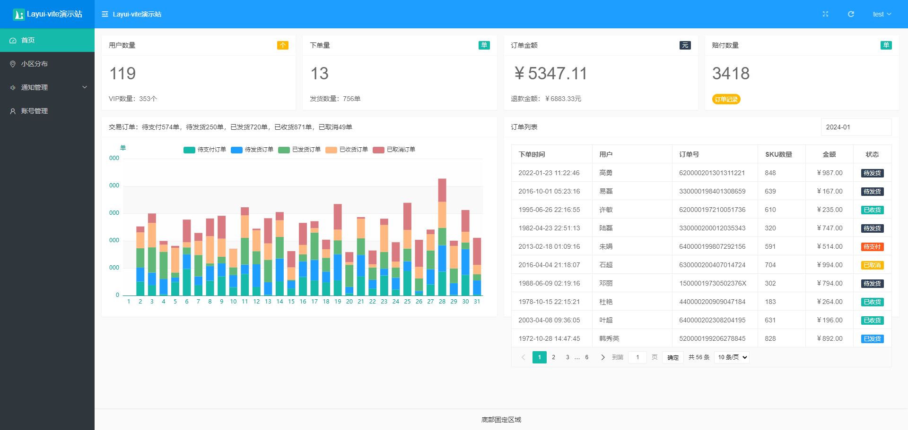

# Layui + Vite

## 项目介绍

使用layui+vite构建项目，使用es模块开发。支持npm安装、支持加载基于layui标准定义的模块
 
页面组成类似小程序。有xxx.css、xxx.js、xxx.html三个文件组成一个页面

1. 使用es模块标准
2. 支持npm
3. 类似小程序的页面组成方式（xxx.css、xxx.js、xxx.html三个文件组成一个页面）
4. 封装了接口请求方法（util/Request.js内部使用fetch封装）
5. 无侵入优化layui table模块，支持请求拦截和url简写，直接在请求接口时处理登录过期和请求接口时自动传递鉴权请求头等优化（util/GlobalUtils.js，使用Proxy代理table的done方法）
6. 支持加载基于layui标准的外部模块，一般用于使用社区提供的其他模块
7. 内部实现了一个简单的响应式模块
8. 发布更新时不存在缓存问题
